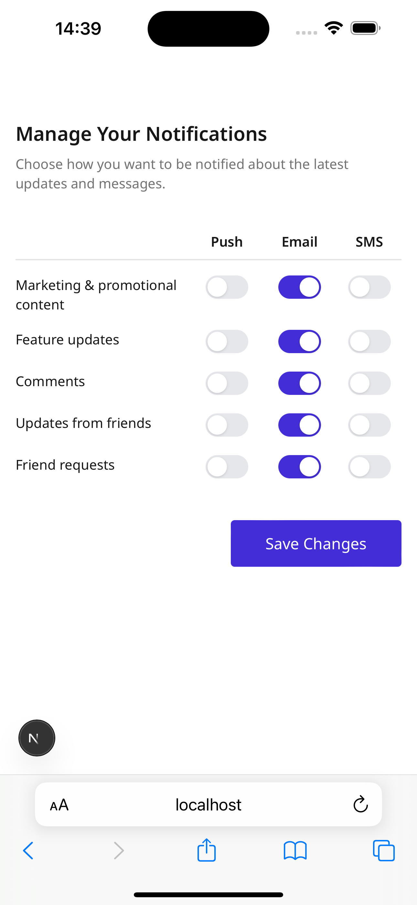

This is a [Next.js](https://nextjs.org) project bootstrapped with [`create-next-app`](https://nextjs.org/docs/app/api-reference/cli/create-next-app).

## Getting Started

First, run the development server:

```bash
npm run dev
# or
yarn dev
# or
pnpm dev
# or
bun dev
```

Open [http://localhost:3000](http://localhost:3000) with your browser to see the result.

You can start editing the page by modifying `app/page.tsx`. The page auto-updates as you edit the file.

This project uses [`next/font`](https://nextjs.org/docs/app/building-your-application/optimising/fonts) to automatically optimise and load [Geist](https://vercel.com/font), a new font family for Vercel.

## Learn More

To learn more about Next.js, take a look at the following resources:

- [Next.js Documentation](https://nextjs.org/docs) - learn about Next.js features and API.
- [Learn Next.js](https://nextjs.org/learn) - an interactive Next.js tutorial.

You can check out [the Next.js GitHub repository](https://github.com/vercel/next.js) - your feedback and contributions are welcome!

## Deploy on Vercel

The easiest way to deploy your Next.js app is to use the [Vercel Platform](https://vercel.com/new?utm_medium=default-template&filter=next.js&utm_source=create-next-app&utm_campaign=create-next-app-readme) from the creators of Next.js.

Check out our [Next.js deployment documentation](https://nextjs.org/docs/app/building-your-application/deploying) for more details.

# 📬 Notification Settings Section

A modular and user-friendly settings panel built with Next.js for managing user notification preferences. Easily customisable and integrable into any modern web application.

## 🚀 Features

- Toggle switches for enabling/disabling notifications
- Support for multiple notification types (Email, SMS, Push, etc.)
- Clean, responsive UI using Tailwind CSS
- Built with accessibility in mind
- Powered by Next.js and React Server Components

## 📸 Screenshots

Here’s how the Notification Settings Section looks across different devices:

### 🧵 Mobile View


## 📦 Tech Stack

- **Framework**: Next.js (App Router)
- **Styling**: Tailwind CSS
- **Language**: TypeScript
- **Font**: Optimised with `next/font` using [Geist](https://vercel.com/font)

## 🛠️ Getting Started

First, run the development server:

```bash
npm run dev
# or
yarn dev
# or
pnpm dev
# or
bun dev
```

Then open [http://localhost:3000](http://localhost:3000) in your browser to view the app.

## 🧩 Usage

You can start editing the page by modifying `app/page.tsx`. The page auto-updates as you edit the file.

Notification preferences can be integrated into your user settings page by importing and rendering the `<NotificationSettings />` component (or whatever your file/component is named).

## ✅ Checklist

- [x] Mobile responsive
- [x] Accessible (ARIA support, keyboard navigation)
- [x] Modular component structure
- [ ] API integration for saving preferences (coming soon)

## 📁 Project Structure

```
📦notifications-settings-section
 ┣ 📂app
 ┃ ┗ 📜page.tsx
 ┣ 📂components
 ┃ ┗ 📜NotificationSettings.tsx
 ┣ 📂styles
 ┃ ┗ 📜globals.css
 ┣ 📜README.md
 ┣ 📜tailwind.config.ts
 ┗ 📜postcss.config.mjs
```

## 🧪 Learn More

- [Next.js Documentation](https://nextjs.org/docs)
- [Tailwind CSS Documentation](https://tailwindcss.com/docs)
- [Vercel Deployment Guide](https://vercel.com/docs)

## 🚀 Deploy

Deploy effortlessly with [Vercel](https://vercel.com/new), the creators of Next.js.

## 📄 License

MIT © 2025 [Your Name or Organisation]